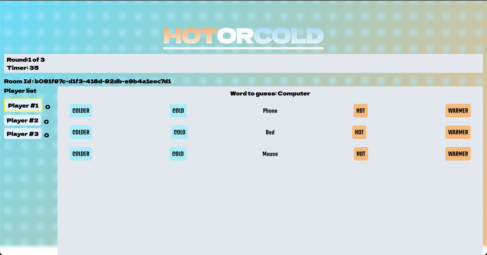
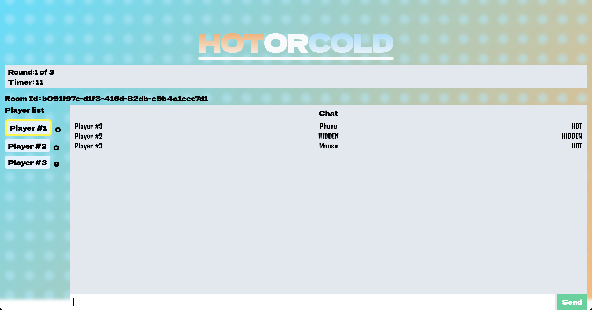

Welcome to the HOTCOLD repo, to get started fork, then clone the repo, and install the required dependencies for the client and server subfolders

## Screenshots

Here are some screenshots of the application in action:

### Word Picker


### Word Guesser


```bash
node version: 18.16.1
git clone "YOUR FORKED URL"

cd server
npm install

cd ../client
npm install
```

## Running Application
Run server (default port @5000):

```bash
cd server
npm start
```

Run client (default port @5173)

```bash
cd client
npm run dev
```


## Learn More

Tailwind docs:
- [Tailwind](https://tailwindcss.com/) - The tailwind website

